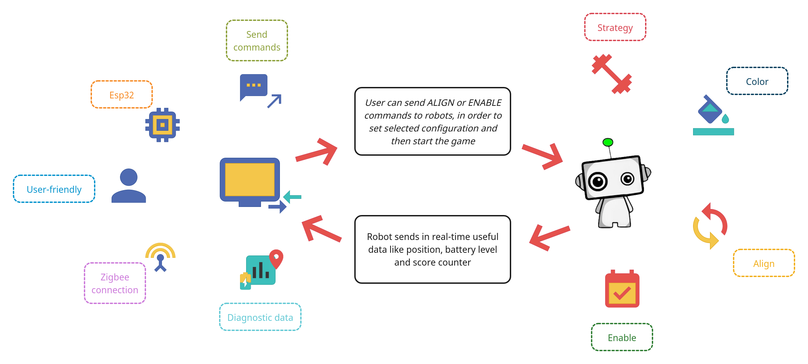
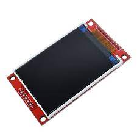
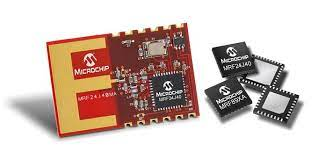
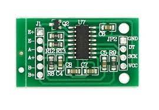
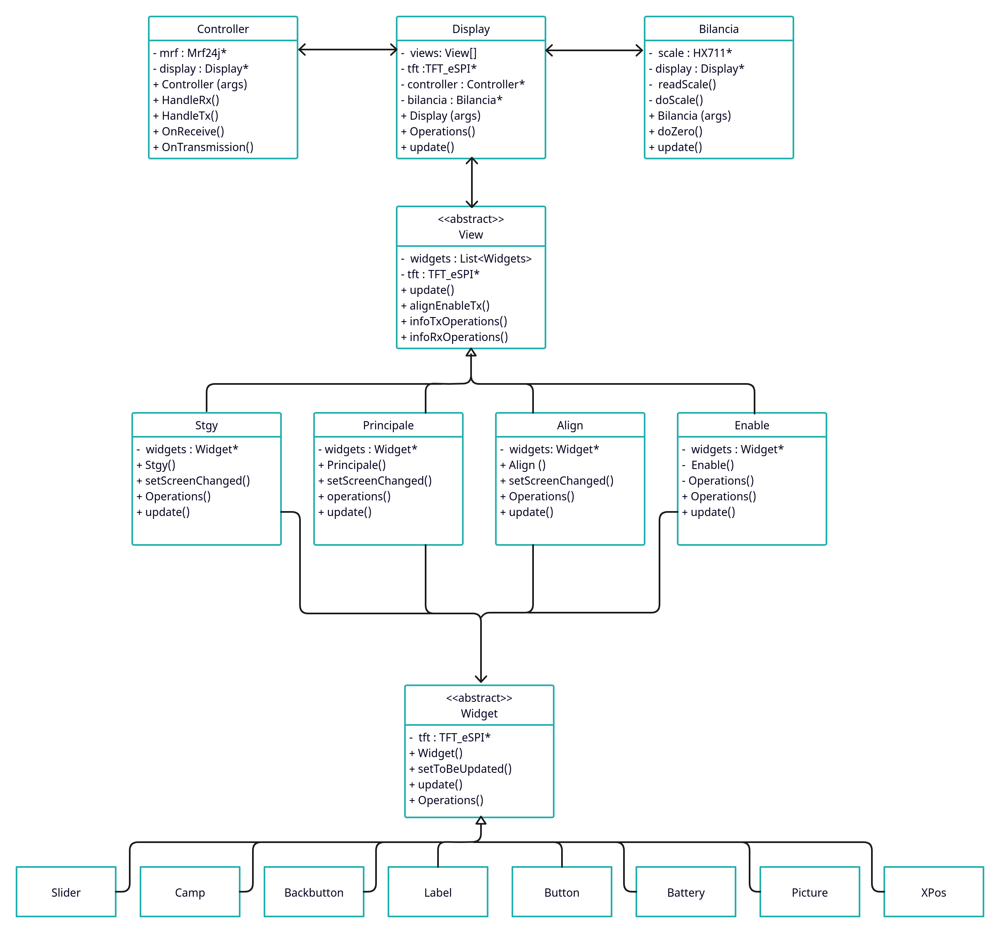
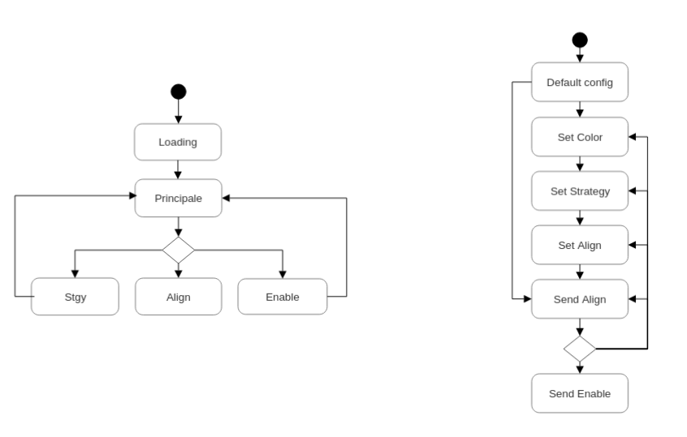
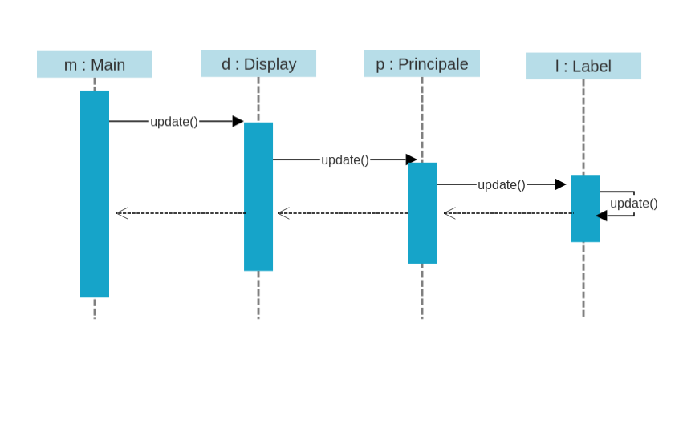

# 						Robot Controller for UNICT-TEAM

#### 																	Internet of things course project - UniCT 2022/2023

------


- [**Introduction**](#Introduction)
- [**Hardware**](#Hardware)
  - [**Esp32-VRoom-32**](#Esp32-VRoom-32)
  - [**ILI9341 TFT display**](#ILI9341-TFT-SPI-display)
  - [**Mrf24j40 Zigbee module**](#Mrf24j40-Zigbee-Module)
  - [**Scale**](#Scale)
    - [**Wheatstone bridge**](#Wheatstone-bridge)
    - [**HX711**](#HX711)
- [**Software design and usability**](#Software-design-and-usability) 
  - **[Software and hardware requirements](#Software-and-hardware-requirements)**
  - **[Design and features](#Design-and-features)**
    - **[UML Class Diagram](#UML-Class-Diagram)**
    - **[FSM for User Interface and commands](#FSM-for-User-Interface-and-commands)**
  - **[Display, Views and Widgets](#Display,-Views-and-Widgets)**
    - **[UML Sequence diagram of update methods](#UML-Sequence-diagram-of-update-methods)**
  - [**Controller and Zigbee protocol**](#Controller-and-Zigbee-protocol)
  - **[Scale data and Score Counter](#Scale-data-and-Score-Counter)**
- **[Prototype](#Prototype)**
- [**Authors**]()

​		

------

# Introduction



The Robot Controller has been designed to interface with two robots, send and receive data in real-time and handle every situation our team is given.

It receives diagnostic data such as position, battery level and score counter (due to the competition rules) and views them in many different ways in order to make the user conscious of the state of the two robots. Moreover, it is possible to send commands with data encapsulated in structures the robots are able to comprehend. Firstly, the user set the color of the camp, the strategy he wants to be used and select the alignment configuration that best fits the situation. Afterwards, he can send an Enable command making the robots start their competition!

 

------

# Hardware 

The components used for the project are:

- An **Esp32-VRoom-32** board, used for flashing firmware and to link all the other components
- A touchscreen **TFT** (Thin Film Transistor) **display** used for User Interface
- A **Mrf24j40** module for providing **Zigbee** connection with robots
- A **scale**, made up of a box designed with a **Wheatstone bridge** and **HX711** chip


## Esp32-VRoom-32

This board is equipped with WI-FI, Bluetooth and BLE modules, targeting a wide range of applications. At the core of this module is the ESP32-D0WDQ6 chip, designed to be adaptive and scalable. There are two CPU cores that can be individually controlled, and the CPU clock frequency is adjustable
from 80 MHz to 240 MHz. The chip also has a low-power coprocessor that can be used instead of the CPU to save power while performing tasks that do not require much computing power, such as monitoring of peripherals. ESP32 integrates a rich set of peripherals, ranging from capacitive touch sensors, SD card interface, Ethernet, high-speed SPI, UART, I2S, and I2C.

> from ESP32-VROOM-32 datasheet
> Espressif Systems
> Copyright © 2023


#### Features

- Two low-power Xtensa® 32-bit LX6 microprocessors
- ESP32-D0WD core
- Supports multiple external QSPI Flash and SRAM chips
- 32Mbits 3.3V SPI flash
- 40MHz crystal

- Onboard PCB antenna for ESP32-WROOM-32D
- U.FL connector (which needs to be connected to an external IPEX antenna) for ESP32-SS or CS is the Chip Select, used to select the slave device wanted to be used
- WROOM-32U
- Advanced power-management technologies

#### Specifications

- 802.11 b/g/n (802.11n up to 150Mbps) Wi-Fi protocol
- BLUETOOTH® v4.2 BR/EDR and BLE
- SD card, UART, SPI, SDIO, I2C, LED PWM, Motor PWM, I2S, and IR module interfaces

- Hall sensor
- 2.7V to 3.6V operating voltage supply
- 80mA average operating current
- -40°C to 85°C operating temperature range


## ILI9341 TFT SPI display

The display has a resolution of 320x240 with dimension of the screen of 2,8". It has a resistive touchscreen and uses SPI peripherals to connect to MCUs.

> TFT (Thin Film Transistor) is a technology applied to LCD (Liquid Crystal Display) or OLED (Organic Light Emitting Diode) displays.

#### Features

-  2.8-inch color screen,support 65K color display,display rich colors
-  320X240 resolution, optional touch function
-  Using the SPI serial bus, it only takes a few IOs to illuminate the display
-  Easy to expand the experiment with SD card slot
-  Provide a rich sample program
-  Military-grade process standards, long-term stable work
-  Provide underlying driver technical support



## Mrf24j40 Zigbee Module

The MRF24J40 is an IEEE 802.15.4™ Standard compliant 2.4 GHz RF transceiver. It integrates the PHY and MAC functionality in a single chip solution. The MRF24J40 creates a low-cost, low-power, low data rate (250 or 625 kbps) Wireless Personal Area Network (WPAN) device. The MRF24J40 interfaces to many popular Microchip PIC® microcontrollers via a 4-wire serial SPI interface, interrupt, wake and Reset pins.



#### Features

- IEEE 802.15.4™ Standard Compliant
  RF Transceiver
- Supports ZigBee®, MiWi™, MiWi P2P and
  Proprietary Wireless Networking Protocols
-  Simple, 4-Wire Serial Peripheral Interface (SPI)
-  Integrated 20 MHz and 32.768 kHz Crystal
  Oscillator Circuitry
-  Low-Current Consumption:
  \- RX mode: 19 mA (typical)
  \- TX mode: 23 mA (typical)
  \- Sleep: 2 μA (typical)
- Small, 40-Pin Leadless QFN 6x6 mm2 Package


## Scale

This scale is made up of a box having a Wheatstone bridge built-in and a HX711 chip.

### Wheatstone bridge

A Wheatstone bridge is an electrical circuit used to measure an unknown electrical resistance by balancing two legs of a bridge circuit, one leg of which includes the unknown component.

- R1, R2 and R3 are known resistors and only R2 is adjustable in order to balance the bridge. 
- Once the bridge is balanced, no current flows through the galvanometer Vg and the potential difference between the two midpoints B and D will be zero, making possible to detect the unknown resistance through this formula:

$$
{\displaystyle {\begin{aligned} R_{x}&={\frac {R_{2}}{R_{1}}}\cdot R_{3}\end{aligned}}}
$$


- Alternatively, if R2 is not adjustable, the voltage difference across or current flow through the meter can be used to calculate the value of Rx, using Kirchhoff's circuit laws. This setup could be faster since it is not necessary to adjust a resistance to zero the voltage.

In our scale the circuit is used to determine the value of the unknown resistance, after the strain made to the box by dropping balls.

> For scoring points during the competitions, the robots must throw some cherries (red balls) into a basket, that for simplicity, is made using a scale (aiming to count the cherries).

This value is turned into a digital signal through the use of the HX711 chip.

------


### HX711

HX711 is a 24-bit ADC (Analog-to-Digital Converter) for weigh scales able to interface directly with a bridge sensor. 

The input multiplexer selects either Channel A or B differential input to the low-noise programmable gain amplifier (PGA). Channel A can be programmed with a gain of 128 or 64, corresponding to a full-scale differential input voltage of ±20mV or ±40mV respectively, when a 5V supply is connected to AVDD analog power supply pin. Channel B has a fixed gain of 32. On-chip power supply regulator eliminates the need for an external supply regulator to provide analog power for the ADC and the sensor. Clock input is flexible. It can be from an external clock source, a crystal, or the on-chip oscillator that does not require any external component. On-chip power-on-reset circuitry simplifies digital interface initialization. There is no programming needed for the internal registers. All controls to the HX711 are through the pins.



- Two selectable differential input channels
- On-chip active low noise PGA with selectable gain
  of 32, 64 and 128
-  On-chip power supply regulator for load-cell and
  ADC analog power supply
- On-chip oscillator requiring no external
  component with optional external crystal
-  On-chip power-on-reset
- Simple digital control and serial interface:
  pin-driven controls, no programming needed
- Selectable 10SPS or 80SPS output data rate
-  Simultaneous 50 and 60Hz supply rejection
- Current consumption including on-chip analog
  power supply regulator:
  normal operation < 1.5mA, power down < 1uA
- Operation supply voltage range: 2.6 ~ 5.5V
-  Operation temperature range: -40 ~ +85°C
-  16 pin SOP-16 package


# Software design and usability

The project has gone through several steps:

- finding the main software and hardware requirements
- design the software structures through the use of UML diagrams and drafts
- coding, testing and refactoring
- reaching current goals and designing next step
- release of the project


## Software and hardware requirements

From the beginning, the controller has been thought to be the means which the user can interact and get useful information from the robots with.        For making that possible, I imagined what could be useful for the user to view. Moreover, the user had to send well-designed commands to the robots, in a certain order, aiming to set them the way he wants to or needs to.

Therefore the controller should:

- show position data of the robots in real-time (X-axis, Y-axis, Theta)
- show battery level of both robots
- show the score achieved by the two robots in a specific view
- send an `ALIGN` command, able to set color, strategy and alignment configuration of each robot
- send an `ENABLE` command, once the `ALIGN` has been done, to make the robots ready for starting the competition

Although they seemed few points to implement, they had to be developed in a conscious way; for example, the `ALIGN` command could not be sent if the user had not selected a strategy, a color and an alignment configuration, because of the structure of the packet the robots need to receive.    Furthermore, if the `ALIGN` command had not been sent, it would not have been safe to send an `ENABLE` command, making it mandatory to handle all of these situations. 


## Design and features

The project has been developed in C++ and makes use of external libraries for the management of the other components:

- `TFT_eSPI` used for the graphics and the touchscreen; it handles internally the SPI configuration of the display with the MCU
- `mrf24j` used for the Zigbee connection
- `HX711` used for interfacing with the scale


In `main.cpp`, the only objects been allocated are `Display`, `Controller`, `Bilancia` and `View` ones:

- `Display` and `View` manage the User Interface, use a `TFT_eSPI` object to realize canvas on the screen, handle dependencies between views and interaction between user and controller.
- `Controller` manages the transmission and the receiving of Zigbee frames from and towards the robots.
- `Bilancia` is the interface used from the main to receive data from the scale.
- `Widget` is an abstract class, which concrete widgets have been inherited from. It is simpler to use graphic objects within views rather than TFT_eSPI functions. 


The final solution proposed for the software is:

#### UML Class Diagram




------

The user must follow a mandatory path in order to send `ALIGN` and `ENABLE` commands correctly:

#### FSM for User Interface and commands



The left finite state machine shows the path the user can follow after the controller powers on, while the the right one shows what steps are needed in order to send `ALIGN` and `ENABLE` commands.

- `STGY`, `ALIGN` and `ENABLE` views can only return back to `PRINCIPALE` view
- `LOADING` state is an initial view where the user waits the scale to set zero.
- `DEFAULT CONFIG` state set default values for color, strategy and alignment configuration, waiting for user to customize them.
- Once `ALIGN` has been sent, user can decide if enabling robots for the competition or send another alignment configuration.

------


## Display, Views and Widgets

- `Display` is the main class within the project and manages the interaction between the views, the controller and the scale:

- `View` is an abstract class that set the basic attributes and methods for a concrete view and keep static data coming from controller and scale, that will be inherited and used by concrete classes.

- `Widget` is an abstract class that set basic basic attributes and methods for concrete widgets, useful "object adapters" of TFT_eSPI.

Here is an example of call invoking fall from `loop()` in `main.cpp` to the generic widget in the current view:

#### UML Sequence diagram of update methods

#### 

- in `main.cpp`

```c++
void loop()
{
    display->update();
}
```

- in `Display`

```c++
void Display::update()
{
    views[current_view]->update();
}
```

- in `View`

```c++
void View::update(){
    for (int i = 0; i < this->widgets.size(); i++) {
        this->widgets[i]->update();
    }
}
```

- in `Label` (inherited from Widget)

```c++
    void update(){
        Widget::update();
        if (!visible) {
            return;
        }
        if (toBeUpdated) {
            drawLabel();
        }
    }
```


------


## Controller and Zigbee protocol

- Controller manages the transmission and the receiving of data from and towards the robots. It is an object adapter that keeps a reference of a Mrf24j object that in `main.cpp` is set up and inside Controller begins the chain of transport of data towards lower levels (views).
- Receiving is handled within Controller starting from `handleRx()`:

```c++
void Controller::handleRx()
{
    uint8_t * _data = (uint8_t*)mrf->get_rxinfo()->rx_data;
    uint16_t addr_robot = mrf->get_rxinfo()->src_addr;

    onReceive(_data, addr_robot);
}
```

it unpacks the frame and sends the payload and the source robot address to Display, that distinguishes the payload and sets the `VIew` attributes with new data:

```c++
void Display::onRadioReceive(uint8_t* data, uint16_t addr_robot)
{
    // robot position handling
    if (data[0] == HEAD_PICCOLO_POS && data[1] == TAIL_PICCOLO_POS)
    {
        t_can_robot_position * pos = (t_can_robot_position *)&data[2];
        // Serial.println(pos->flags);
        if(addr_robot == PICCOLO_ADDRESS){
            View::setTCanRobotPosition(*pos,PICCOLO_INDEX);
        }
        else if(addr_robot == GRANDE_ADDRESS){
            View::setTCanRobotPosition(*pos,GRANDE_INDEX);
        }
    }
// more code
}
```


- Data is encapsulated inside Zigbee payload such as CAN packets, to make it easier to the robots to recognize and typecast them.

> CAN (Controller Area Network) is a communication network designed by Bosch to connect MCUs or ECUs together. It is widely used in robotics, industrial automation, cars and planes!

Example of a structure defined for a CAN payload:

```c++
typedef struct
{
	unsigned char cmd;
	unsigned char flags;
	unsigned int elapsed_time;
    unsigned char stgy;
    unsigned char align;
	char padding[2];
}  __attribute__((packed)) t_can_strategy_command;
```

This is the structure we use in the project to encapsulate user-customized data like color (flags), strategy (stgy) and alignment (align) in `ALIGN` command.

- The Zigbee frame is sent in `main.cpp` through the `Mrf24j` method `send16()`, that takes in input the destination address (#FFFFFF is broadcast), the payload (our CAN packet) and the size in byte of the payload:

```c++
void transmission()
{
  delay(1);
  if(controller->onTrasmission() != nullptr)
  {
    uint8_t* result = controller->onTrasmission();
    data[0] = 0x10;
    data[1] = 0x07;
    for(uint8_t i=2; i<12; i++)
    {
      data[i] = result[i-2];
    }
    mrf->send16(0xFFFF,data, 12); // da provare
    display->setTxFlag(false);
    Serial.printf("data correctly sent\n");
  }
}
```

`onTrasmission()` always returns  `nullptr` unless user selects a command. 

## Scale data and Score Counter

Scale is defined within the project by the class `Bilancia`, that adapts `HX711` library methods to our specific need. Its methods `do_zero()` and `do_scale()` are the ones used for counting balls inside the scale. 

```c++
void Bilancia::do_zero()
{
  long sum = 0;
  Serial.println("Doing zero...");
  for (int i = 0; i < MAX_ZERO;i++) {
    long data = read_scale();
    if (data > 0)
      sum += data;
    else
      i--;
    delay(1);
  }
  _zero = sum / MAX_ZERO;
}
```

`do_zero()` sets the "zero" in the `LOADING` state of the Controller.

```c++
int Bilancia::do_scale()
{
    int balls_estimate = -1;
    long data = read_scale();
    if (data > 0) {
      data = data - _zero;
      float balls_low = data / 6500.0;
      float balls_high = data / 7500.0;
      balls_estimate = (int)(balls_high + 0.5);
    }
    return balls_estimate;
}
```

`do_scale()`  returns the number of balls gathered inside the scale, by an estimation made on a voltage value returned by `read_scale()`.

```c++
void Enable::setBasketScore()
{
    char s[80];
    int numPalline = View::getNumPalline();
    sprintf(s,"%2d",numPalline);
    scoreBasket->setToBeUpdate(true);
    scoreBasket->setText(s);
}
```

This number of balls is stored within `View` class and called periodically by Enable `setBasketScore()` method to show them on screen.

```c++
void Enable::setTotScore()
{
    char s[80];
    t_can_score_data score = View::getScore();
    int total = score.score + View::getNumPalline()*3;
    sprintf(s,"Score: %3d", total);
    totScore->setToBeUpdate(true);
    totScore->setText(s);
}
```

Total score has to be shown on the screen during the competition and is the result of the sum of the partial score sent by the two robots (`t_can_score_data`) and the number of balls.

# Prototype


# Authors

- Giovanni Campo

co-authored by:

- Federico Fausto Santoro, PhD
- Stefano Borzì
- Corrado Santoro, PhD
- Marco Pometti
